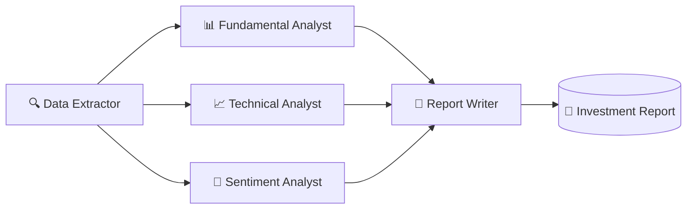

# 🔱 Trinetra-FinAI


> **A multi-agent AI system for intelligent stock market research and decision support — running 100% locally.**

Trinetra-FinAI orchestrates a collaborative team of specialized AI agents that research, analyze, and synthesize a comprehensive investment report for any publicly listed company. Inspired by the *Trinetra* (the third eye of clear sight), it fuses three lenses of analysis - **fundamental, technical, and sentiment** - into a single strategic view, with no data ever leaving your machine.

---

## Table of Contents

- [Why Trinetra-FinAI](#-why-trinetra-finai)
- [Key Features](#-key-features)
- [Architecture](#-architecture)
- [The Agent Crew](#-the-agent-crew)
- [Built With](#-built-with)
- [Getting Started](#-getting-started)
- [Configuration](#-configuration)
- [Usage](#-usage)
- [Project Structure](#-project-structure)
- [Sample Output](#-sample-output)
- [Roadmap](#-roadmap)
- [Contributing](#-contributing)
- [Disclaimer](#-disclaimer)
- [License](#-license)

---

## 🎯 Why Trinetra-FinAI

Most retail research is fragmented - fundamentals in one tab, charts in another, news in a third - and stitching them together is slow and inconsistent. Trinetra-FinAI automates that workflow with a coordinated crew of agents, each an expert in one domain, that hand off their findings to a final analyst for synthesis.

- **100% local & private** - runs entirely through [Ollama](https://ollama.ai/). No API keys, no per-token billing, no data sent to third parties.
- **Multi-perspective by design** - fundamental, technical, and sentiment signals are weighed together rather than in isolation.
- **Explainable** - every section of the final report traces back to the agent that produced it.
- **Extensible** - agents, tools, and tasks are modular; add a new data source or analyst without touching the rest of the pipeline.

---

## ✨ Key Features

- Automated end-to-end research pipeline for any listed ticker
- Fundamental scoring (P/E, EPS, revenue growth, debt ratios)
- Technical signal generation (RSI, MACD, moving averages, support/resistance)
- News & social sentiment scoring via VADER
- Synthesized, structured investment report as the final deliverable
- Sequential agent orchestration powered by CrewAI

---

## 🏗 Architecture

The system runs a **sequential pipeline of 5 agents across 8 tasks**, flowing from raw data extraction to a final strategic report.



The Data Extractor produces a clean, shared dataset. The three analysts work from that common source — each scoring its own dimension — and the Report Writer consolidates all signals into one coherent recommendation. All LLM inference is served locally by Ollama.

---

## 🤖 The Agent Crew

| Agent | Role | Responsibilities |
|---|---|---|
| 🔍 **Data Extractor** | Pulls price, volume, and financial statements | Data fetch, cleaning & preprocessing |
| 📊 **Fundamental Analyst** | Evaluates company health | P/E, EPS, revenue growth, debt ratios → fundamental score |
| 📈 **Technical Analyst** | Reads price action | RSI, MACD, moving averages, support/resistance → technical signals |
| 📰 **Sentiment Analyst** | Gauges market mood | News headlines & social signals → sentiment score (VADER) |
| 📝 **Report Writer** | Synthesizes the verdict | Combines all inputs into a structured final report |

---

## 🛠 Built With

- **[CrewAI](https://www.crewai.com/)** — orchestrates the multi-agent framework and task hand-offs.
- **[Ollama](https://ollama.ai/)** — runs the LLMs 100% locally for privacy and zero API cost.
- **[VADER](https://github.com/cjhutto/vaderSentiment)** — lexicon-based sentiment scoring tuned for short-form text.
- **Python 3.10+** — the core language powering data extraction and orchestration logic.

---

## 🚀 Getting Started

### Prerequisites

- **Python 3.10+**
- **[Ollama](https://ollama.ai/)** installed and running locally
- At least one pulled model (e.g. `llama3`, `mistral`, or `qwen2.5`)

### 1. Clone the repository

```bash
git clone https://github.com/<your-username>/trinetra-finai.git
cd trinetra-finai
```

### 2. Set up a virtual environment

```bash
python -m venv .venv
source .venv/bin/activate        # On Windows: .venv\Scripts\activate
```

### 3. Install dependencies

```bash
pip install -r requirements.txt
```

### 4. Pull a local model with Ollama

```bash
ollama pull llama3
ollama serve        # if it isn't already running
```

---

## ⚙️ Configuration

Create a `.env` file in the project root to point the crew at your local model and any data sources:

```env
# LLM (served by Ollama)
OLLAMA_MODEL=llama3
OLLAMA_BASE_URL=http://localhost:11434

# Optional: API keys for richer market/news data
# NEWS_API_KEY=your_key_here
```

> Adjust the model name to match whatever you pulled with `ollama pull`. No cloud LLM keys are required for the core pipeline.

---

## ▶️ Usage

Run the crew against any ticker:

```bash
python main.py --ticker AAPL
```

The pipeline will spin up the agents in sequence and write the final report to the `outputs/` directory.

> Replace `main.py` and the flag names with your actual entry point if they differ - adjust this section to match the repo.

---

## 📁 Project Structure

```
trinetra-finai/
├── agents/             # Agent definitions (role, goal, backstory, tools)
├── tasks/              # Task definitions and expected outputs
├── tools/              # Custom tools (data fetch, indicators, sentiment)
├── outputs/            # Generated investment reports
├── config/             # Model & pipeline configuration
├── main.py             # Entry point — assembles and kicks off the crew
├── requirements.txt
└── README.md
```

> This reflects a conventional CrewAI layout — tweak it to match your actual tree.

---

## 📄 Sample Output

```
=================== TRINETRA-FINAI REPORT: AAPL ===================
Fundamental Score : 7.5 / 10   (Strong revenue growth, low debt)
Technical Signal  : NEUTRAL     (RSI 54, price above 50-DMA)
Sentiment Score   : +0.32       (Mildly positive news flow)
-------------------------------------------------------------------
Verdict: HOLD — solid fundamentals, but momentum and sentiment
suggest waiting for a clearer entry point.
===================================================================
```

---

## 🗺 Roadmap

- [ ] Parallel agent execution for faster runs
- [ ] Web UI / dashboard for report viewing
- [ ] Backtesting module for historical signal validation
- [ ] Configurable scoring weights per investor profile
- [ ] Support for multiple tickers / portfolio-level analysis
- [ ] Pluggable data providers (Yahoo Finance, Alpha Vantage, etc.)

---


## ⚠️ Disclaimer

Trinetra-FinAI is a **research and educational tool**. Its outputs are **not financial advice** and should not be the sole basis for any investment decision. LLM-generated analysis can be incomplete or wrong. Always do your own research and consult a licensed financial professional before investing.

---

## 📜 License

Distributed under the MIT License. See [`LICENSE`](LICENSE) for details.

---

<p align="center">Built with 🔱 and a healthy respect for risk.</p>
